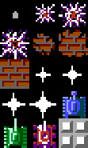

## Pixi.js Game

### About the project

This Pixi.js and TypeScript game about tanks is a test task for an amazing job application.

The game features a map of 50 x 50 blocks (1 block = 35px x 35px) populated with 25 hays and 50 walls. Hays have 100 health but are destructible, while the walls are indestructible. Players take control of one of three tanks (Red, Blue, Green) which can move and rotate using keyboard inputs and shoot bullets. Each tank fires a different number of bullets with different damage - red fires 2 bullets with 10 damage, blue fires 3 bullets with 20 damage and green fires 1 bullet with 25 damage. Players can change the tank they control at any time during the game by pressing 'T' on the keyboard.

On top of the base features stated in the task, I added inertia, friction, different acceleration rates and maximum speeds for tanks for more interesting movement mechanics.
Dynamic resizing of the application and a camera tied to the player have also been implemented to provide a comfortable game experience.

### Controlls

To control the tanks, you can use the following keys:

- **Up Arrow**: Accelerate forward
- **Down Arrow**: Accelerate backward
- **Left Arrow**: Rotate 90° counterclockwise
- **Right Arrow**: Rotate 90° clockwise
- **Space Bar**: Fire
- **T**: Change Tank

### Instructions to run the game

How to run the app:

1. Clone the project
2. Install the dependencies with `npm install`
3. Run the project with script `npm run start`
(Alternatively, you can `npm run build` and host the build version of game on web (or open browser with --allow-file-access-from-files). Otherwise you will get CORS Error.)
